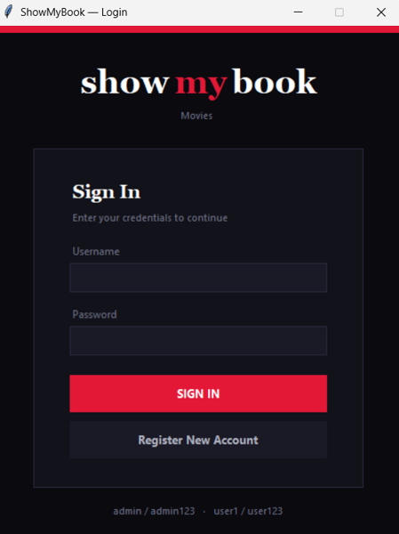
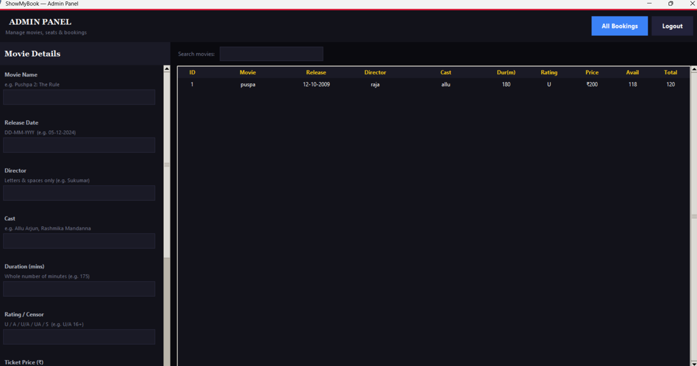
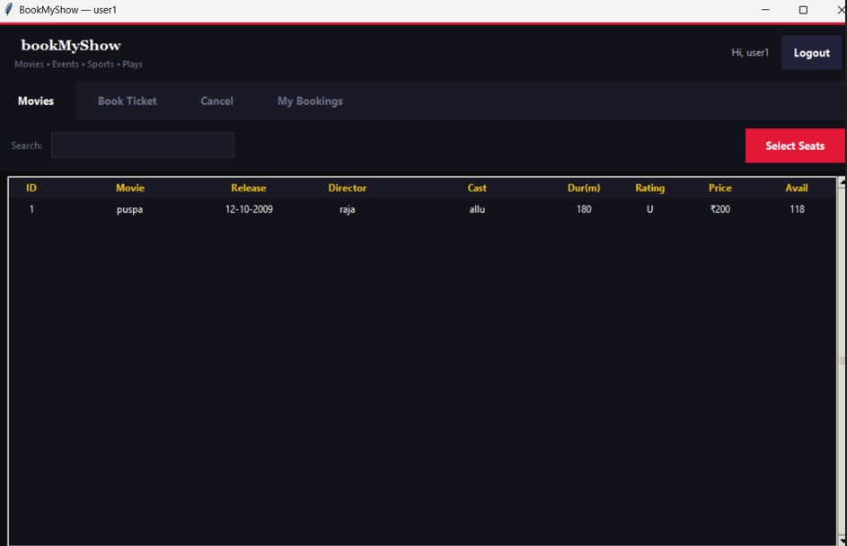
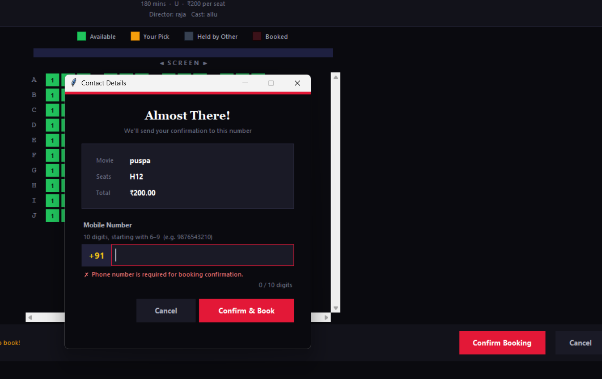
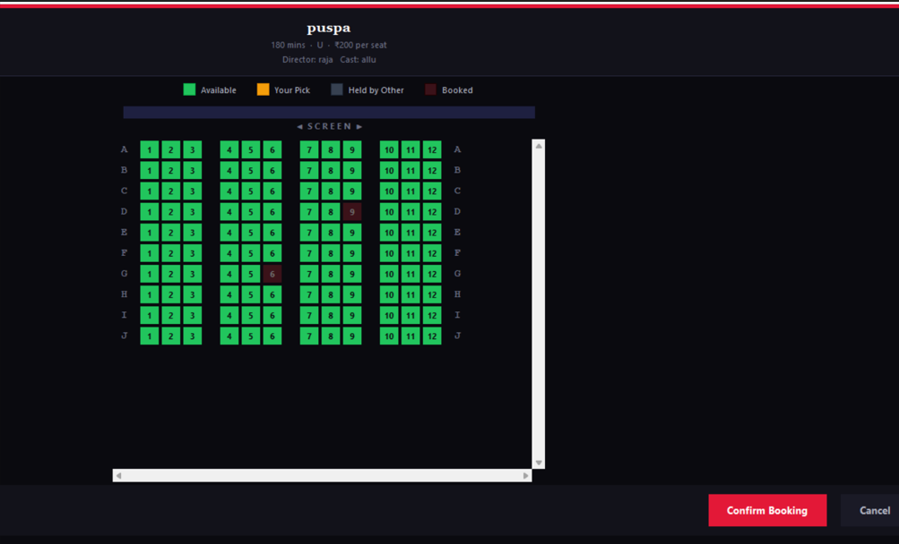

# 🎬 ShowMyBook

<div align="center">


### 🍿 A Modern Movie Ticket Booking System Built with Python, Tkinter & SQLite

Book tickets • Select seats • Manage movies • Track bookings

</div>

---

## 🌟 Overview

**ShowMyBook** is a desktop-based Movie Booking System designed to simplify movie ticket reservations through an intuitive graphical interface.

The application provides separate dashboards for **Users** and **Administrators**, allowing seamless movie management, seat selection, booking confirmation, and booking history tracking.

Built as a **DBMS Mini Project**, it demonstrates the practical implementation of:

- Database Management Systems
- CRUD Operations
- GUI Development
- Input Validation
- Seat Management
- Booking Systems

---

# ✨ Key Features

## 👤 User Module

### 🔐 Authentication
- User Registration
- Secure Login System
- Role-Based Access

### 🎥 Movie Management
- Browse Available Movies
- Search Movies Instantly
- View Movie Details

### 🎟 Ticket Booking
- Interactive Seat Selection
- Live Seat Availability
- Multiple Seat Booking
- Booking Confirmation

### 📱 Contact Verification
- Mobile Number Validation
- SMS Confirmation Simulation

### 📚 Booking History
- View Previous Bookings
- Track Spending
- Booking Records

### ❌ Cancellation
- Cancel Existing Bookings
- Automatic Seat Release

---

## 🛠 Admin Module

### 🎬 Movie Control
- Add Movies
- Update Movie Details
- Delete Movies

### 🪑 Seat Management
- Custom Theatre Layout
- Dynamic Rows & Columns
- Seat Availability Monitoring

### 📊 Booking Management
- View All Bookings
- Monitor Ticket Sales
- Customer Booking Information

---

# 🚀 Advanced Features

## 🔒 Real-Time Seat Locking

When a user selects seats:

- Seats become temporarily locked
- Other users cannot select them
- Prevents double-booking
- Lock expires automatically after timeout

---

## ✅ Smart Validation System

The application validates:

| Field | Validation |
|---------|------------|
| Movie Name | Required |
| Director Name | Letters Only |
| Release Date | DD-MM-YYYY |
| Duration | Numeric |
| Rating | U / A / UA |
| Ticket Price | Positive Value |
| Phone Number | Valid Indian Mobile |

---

## 🏗 System Architecture

```text
┌──────────────────┐
│    FRONTEND      │
│    Tkinter GUI   │
└────────┬─────────┘
         │
         ▼
┌──────────────────┐
│    BACKEND       │
│ Business Logic   │
└────────┬─────────┘
         │
         ▼
┌──────────────────┐
│     SQLite       │
│    Database      │
└──────────────────┘
```

---

# 📂 Project Structure

```text
ShowMyBook/
│
├── frontend.py
├── backend.py
├── movie.db
│
├── README.md
├── LICENSE
└── .gitignore
```

---

# 🗄 Database Schema

## Users Table

```sql
users
```

| Field | Type |
|---------|---------|
| user_id | INTEGER |
| username | TEXT |
| password | TEXT |
| role | TEXT |

---

## Movies Table

```sql
movies
```

| Field | Type |
|---------|---------|
| movie_id | INTEGER |
| movie_name | TEXT |
| release_date | TEXT |
| director | TEXT |
| cast | TEXT |
| duration | INTEGER |
| rating | TEXT |
| ticket_price | REAL |

---

## Bookings Table

```sql
bookings
```

Stores:

- Booking Details
- User Information
- Seat Numbers
- Phone Numbers
- Total Amount

---

# ⚙ Installation

## Clone Repository

```bash
git clone https://github.com/yourusername/showmybook.git
```

## Move Into Project

```bash
cd showmybook
```

## Run Application

```bash
python frontend.py
```

---

# 🔑 Default Credentials

## Admin

```text
Username: admin
Password: admin123
```

## User

```text
Username: user1
Password: user123
```

---

# 🎟 Booking Workflow

```text
Login
   ↓
Browse Movies
   ↓
Select Movie
   ↓
Choose Seats
   ↓
Enter Mobile Number
   ↓
Confirm Booking
   ↓
Booking Successful
```

---

# 📸 Screenshots

## Login Page

```text
(Add Screenshot Here)

```

## Admin Dashboard

```text
(Add Screenshot Here)

```

## Movie Selection

```text


```

## Seat Booking Interface

```text

```


---

# 🎯 Learning Outcomes

This project demonstrates:

- Database Design
- SQL Operations
- GUI Development
- Python Programming
- Input Validation
- CRUD Functionality
- Role-Based Access Control

---

# 🔮 Future Enhancements

- 💳 Payment Gateway Integration
- 📧 Email Notifications
- 🎫 QR Code Tickets
- 🎥 Movie Posters
- 🌐 Web Version
- ☁ Cloud Database
- 📲 Real SMS Service

---

# 🏆 Project Highlights

✅ Role-Based Authentication

✅ Movie Management System

✅ Dynamic Seat Selection

✅ Seat Locking Mechanism

✅ Booking History

✅ SQLite Database

✅ Modern Tkinter Interface

✅ Input Validation

✅ Booking Cancellation

---

<div align="center">

### 🍿 "Your Seat. Your Show. Your Experience."

Made with ❤️ using Python, Tkinter and SQLite

</div>